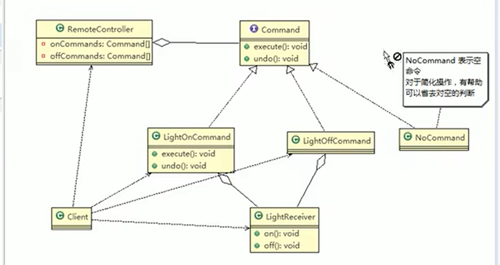
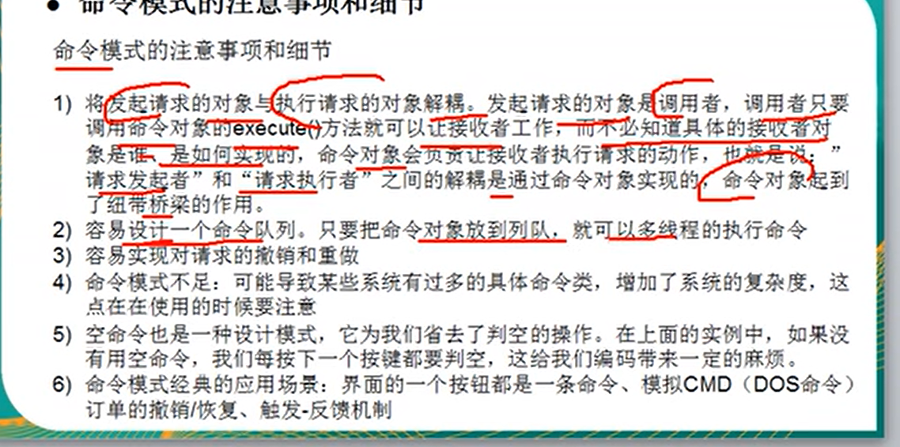

命令(Command)模式又叫作动作(Action)模式或事务(Transaction)模式，是一种对象的行为模式。将一个请求封装为一个对象，从而使你可用不同的请求对客户进行参数化；对请求排队或记录请求日志，以及支持可撤消的操作。

命令模式的本质：封装请求

设计意图：命令模式通过将请求封装到一个命令(Command)对象中，实现了请求调用者和具体实现者之间的解耦。 

案例说明：我们有多种不同厂家的家具，为了达到智能调控的效果，需要去下载各个厂家的APP

但我们又不想每个厂家都下载app，我们可以自己建造一个遥控软件，统一调控所有的功能

与外观模式的区别就在于，外观模式只能统一全部启动，全部关闭

而命令模式每一个命令都是一个子类，可以根据实现的命令完成每种产品的分别开关

