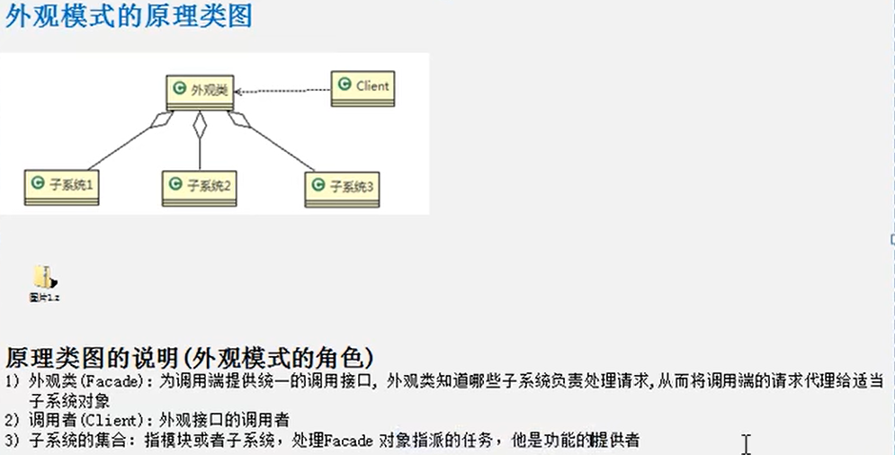

外观模式（过程模式）：为子系统中的一组接口提供一个一致的界面，也就是定义一个高层的接口，去统一调用，屏蔽子系统的实现细节。

案例说明：类似于要组件一个家庭影院

需要打开爆米花机，DVD播放机，自动屏幕，立体环绕声，投影仪等

如果每个都在Main方法中，创建对应的实例，再去调用开关按钮，就会显得比较冗余。

那么我们可以把其中的方法抽取出来，构建一个高层接口来表示一个统一的界面遥控器，去调用各类的启动关闭方法。我们将这个高层的接口称为外观类

