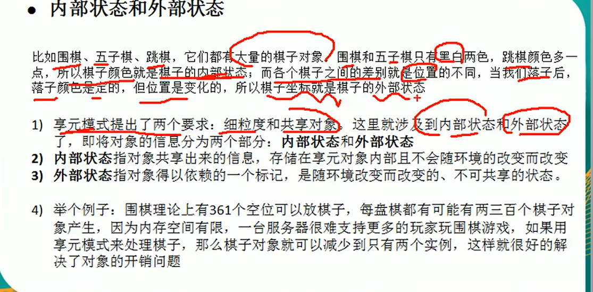

享元模式：它使用共享物件，用来尽可能减少内存使用量以及分享资讯给尽可能多的相似物件；它适合用于只是因重复而导致使用无法令人接受的大量内存的大量物件。通常物件中的部分状态是可以分享。

其目的是为了尽可能的减少相同作用的对象创建，这种模式广泛应用于各类池，例如 数据库连接池，线程池，字符串常量池等

外部状态是不能随着内部状态的改变而改变的

案例说明：一个网站需要多种发布形式，但我们通常不希望给每种发布形式都创建一个实例去定制化，这样的话后期维护会非常麻烦

因此可以引入享元模式来解决这个问题,其实有点类似于用Redis做缓存

