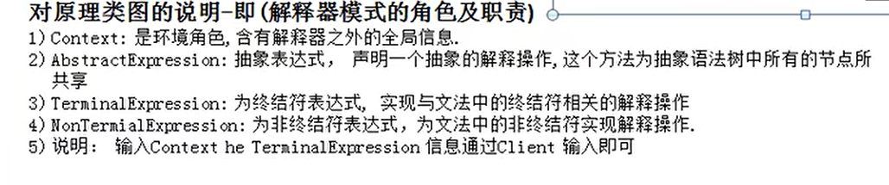

解释器模式 解释器模式(Interpreter Pattern)提供了评估语言的语法或表达式的方式,它属于行为型模式。

案例说明：我们想定义一个基础的四则运算，a+b-c+d+e

先定义一个算式，再输入对应的值，输出相应的答案

按照传统方法我们可以将算式传入一个方法内，再进行计算，但问题就在于如果想要添加更新运算符，这种方法就比较冗余

原理类图：

但解释器模式苦于后期维护困难，一般只有在大型的项目当中才能见到它的身影，而且现在有不少高效率的开源解析工具，应用他们几乎可以完成大多数运算

因此解释器模式在实际开发中的应用非常少见。