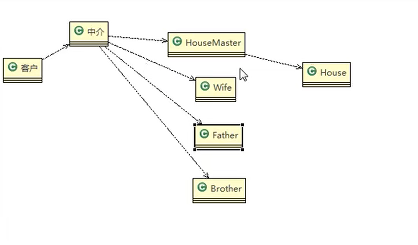
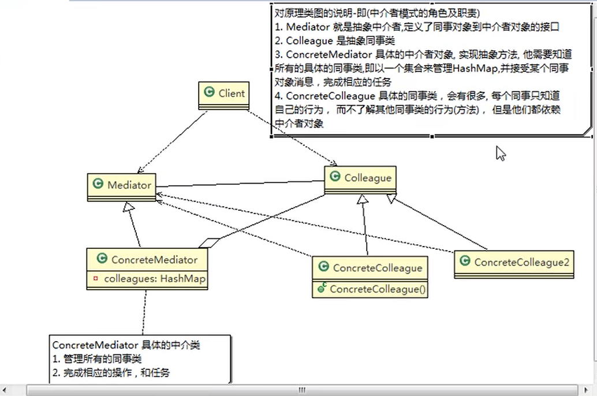
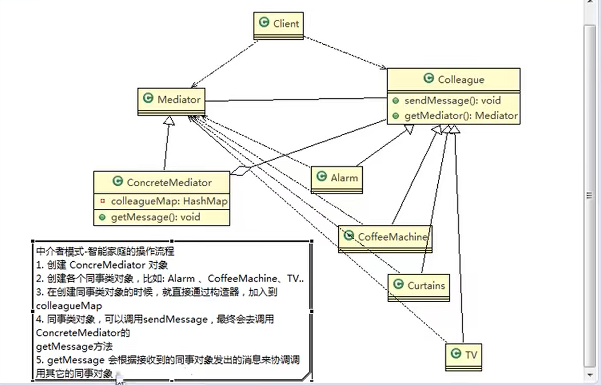

中介者模式（Mediator），用一个中介对象来封装一系列的对象交互。中介者使各个对象不需要显式地相互引用，从而使其耦合松散，而且可以独立地改变它们之间的交互

比如说客户想要去找房，那么可以先找到中介，中介去协调房东的信息，而客户可以不了解中介如何去协调的，只需要知道中介返回的结果。

原理类图：

案例说明：智能家居模式，我们想要在开启电视机的同时，拉下窗帘，打开咖啡机

我们就可以使用中介者来调用这些操作步骤，电视机，窗帘，咖啡机，就各自是同事类的实现类，而这些实现类之间不会进行相互的调用

案例类图：
