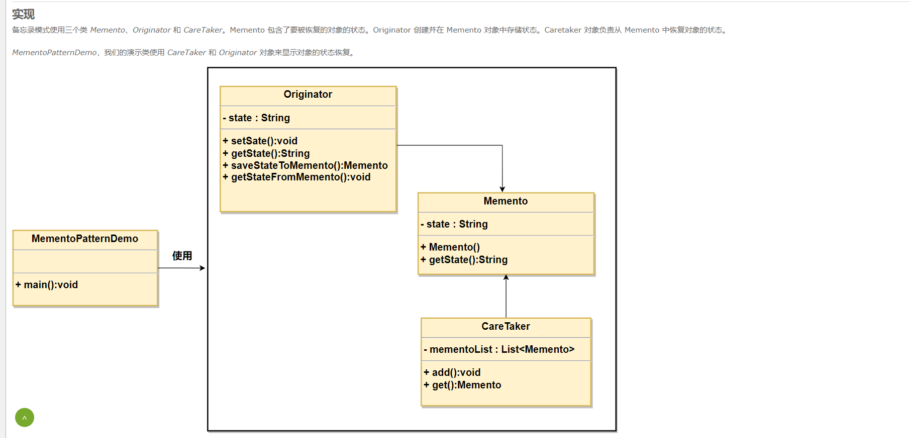

备忘录模式 备忘录模式(Memento Pattern)保存一个对象的某个状态,以便在适当的时候恢复对象。备忘录模式属于行为型模式。

优点： 1、给用户提供了一种可以恢复状态的机制，可以使用户能够比较方便地回到某个历史的状态。 2、实现了信息的封装，使得用户不需要关心状态的保存细节。

缺点：消耗资源。如果类的成员变量过多，势必会占用比较大的资源，而且每一次保存都会消耗一定的内存。

使用场景： 1、需要保存/恢复数据的相关状态场景。 2、提供一个可回滚的操作。

类图：

