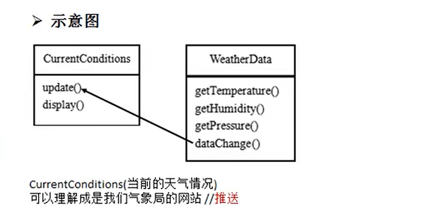
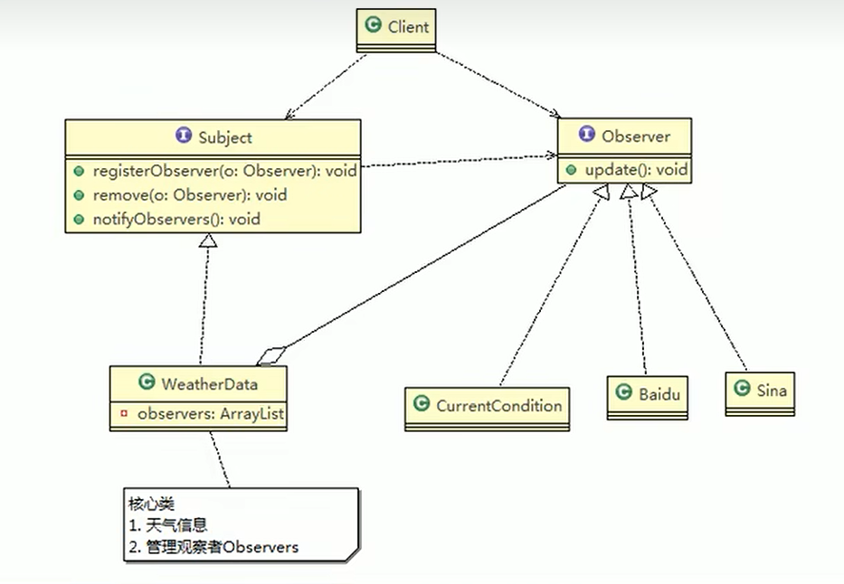

观察者模式：观察者模式 当对象间存在一对多关系时,则使用观察者模式(Observer Pattern)。比如,当一个对象被修改时,则会自动通知依赖它的对象。观察者模式属于行为型模式。

案例说明：我们想要制作一个天气预报的推送功能，将温度，气压，湿度，实时推送给第三方（一旦被修改，立刻推送给第三方）

传统方案说明：

可以看出传统方案的缺点很明显，如果想要扩展天气预报的内容，则需要每个get方法都修改

因此引出我们的观察者模式来处理这个一对多的关系

可以将天气信息（一）推送给百度，新浪，天气站（对应的多）

相关类图：
