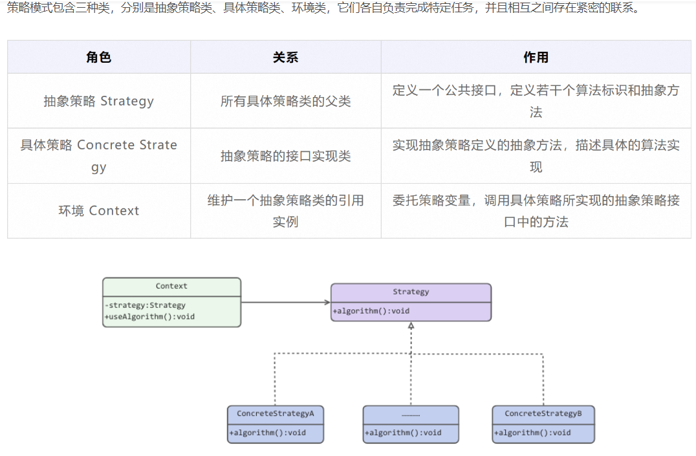

策略模式:的核心思想是对算法进行封装，委派给不同对象来管理。这样，我们就可以定义一系列算法，
将每个算法封装到具有公共接口的一系列具体策略类中，从而使它们可以灵活替换，并让算法可以在不影响到客户端的情况下发生变化。同时，策略模式仅仅封装算法（包括添加、删除），
但其并不决定在何时使用何种算法，算法的选择由客户端来决定。

原理类图：

案例说明：除了双11购物狂欢节，每年都会打造很多其他的促销活动。试想一下，如果每种大促活动都使用一种促销模式，
未免太过枯燥，于用户、商家、平台而言都不友好。因此，为了提升用户购买体验、突出商家营销特点，需要面向不同大促活动使用不同的策略进行促销。这里以促销策略为例，简单分析策略模式如何使用。

