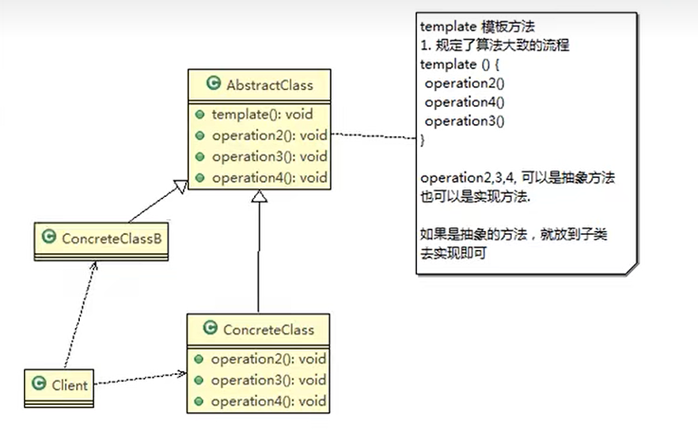

模板模式又叫模版方法模式(Template Method Pattern)，是指定义一个算法的骨架，并允许子类为一个或多个步骤提供实现。模板模式使得子类可以在不改变算法结构的情况下，重新定义算法的某些步骤，属于行为型设计模式。模版模式适用于以下场景：

（1）一次性实现算法的不变部分，并将可变的行为留给子类来实现。

（2）各子类中公共的行为被提取出来并集中到一个公共的父类中，从而避免代码重复。

案例分析：模板模式来解决豆浆的制作问题

制作豆浆的流程:

选材---->添加配料---->浸泡---->放到豆浆机打碎
通过添加不同的配料，可以制作出种类不同的豆浆，但这个制作的过程对于每种豆浆而言都是一样的，这样就适用于模板模式