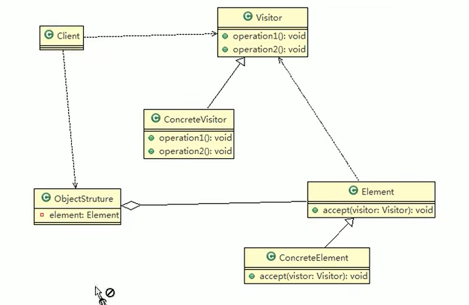
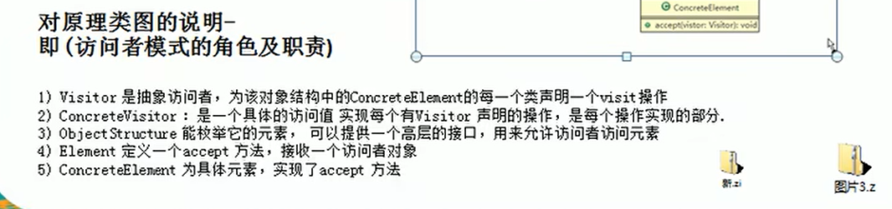
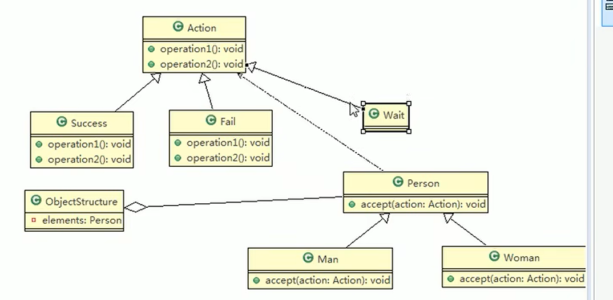

访问者模式的本质是将数据结构和数据操作分离，通过定义一个访问者对象，实现对数据结构中各个元素的访问和处理，从而达到解耦和灵活性的目的。

据《大话设计模式》中说算是最复杂也是最难以理解的一种模式了。

 

案例说明：我们想对各个演出进行评分，评分者分为男人与女人，针对不同评分可以做出不一样的操作

例如：评分通过，评分失败，评分待定等等，访问者模式的优越性就在于，我们后期随意添加评分者的类型，或者是评分的操作，都可以只添加一个子类就可以完成，不用去修改其他代码

真正地实现了数据结构与数据操作的分离

